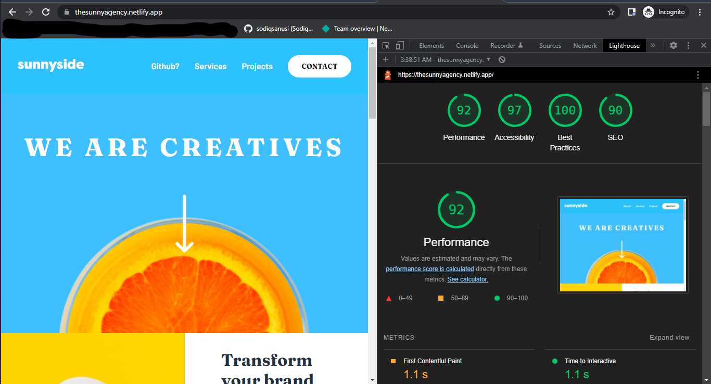

# Sunnyside Agency - A branding company.

## Table of contents

- [Overview](#overview)
  - [The challenge](#the-challenge)
  - [Screenshot](#screenshot)
  - [Links](#links)
- [My process](#my-process)
  - [Built with](#built-with)
  - [What I learned](#what-i-learned)
  - [Continued development](#continued-development)
  - [Useful resources](#useful-resources)
- [Author](#author)
- [Acknowledgments](#acknowledgments)

## Overview
The goal basically was to reproduce the site just as the designs were with additional interactiveness in between. Due to it been a static site, HTML CSS & JS were enough for the scope of the project. Decided to also try optimizing it as best as I can right now, will keep working on improving my code optimization skills.
### The challenge

Users should be able to:

- View the optimal layout for the site depending on their device's screen size.
- See hover states for all interactive elements on the page.
- Open the mobile menu on small devices.
- Load up the site in 2s or less (use Google Lighthouse metrics to check this) incurring minimal costs on their end.

### Screenshot

### Links

- Solution URL: [https://github.com/sodiqsanusi/sunnyside-agency/](https://github.com/sodiqsanusi/sunnyside-agency/)
- Live Site URL: [https://thesunnyagency.netlify.app/](https://thesunnyagency.netlify.app/)

## My process
Due to the high amount of visual content and my preference towards a better mobile interface, used the mobile-first workflow during the buildup. Also experimented with responsive typography and it worked!😊 Responsive typography is something I'm definitely learning on better in the coming weeks.
### Built with

- Semantic HTML5 markup
- CSS custom properties
- Flexbox
- CSS Grid
- Mobile-first workflow

### What I learned
- Learnt more on responsive typography.
- Worked on using multiple sized images on the same element using the `<picture>` HTML elements and the respective `srcset`s

### Continued development
Even though I understand one can't fully understand CSS, I feel I can still improve a lot on it, so it's a place where I need to continously develop and I'm planning to do that by doing random CSS projects. This may not be full sites, just lovely CSS stuffs.

### Useful resources

- [Creating fancy corners using CSS - LogRocket](https://blog.logrocket.com/how-to-create-fancy-corners-in-css/) - There was a part of the website that needed a speech bubble kind of interface, even though I knew an `::after` CSS pseudoelement will do it, didn't know how to go about getting those curves. This article helped clear that issue and it's a read I recommend for anyone using CSS heavily.
- [Converting a hexcode to a filter property.](https://codepen.io/sosuke/pen/Pjoqqp) - This is an amazing codepen where you can convert an hexcode into a filter property that can be used directly in CSS code. This filter property can then be applied to an `img` HTML element to style SVG icons without needing to alter with the SVG code directly.

## Author
Yours faithfully built this with designs gotten from FrontendMentor.
- Twitter - [@sodiqsanusi0](https://www.twitter.com/sodiqsanusi0)

## Acknowledgments
Shoutout to the frontendmentor team for these wonderful designs, and to Angela Yu who taught me my first CSS code😄, I don't know why I said that, take it like that. 
Ciaoo.
